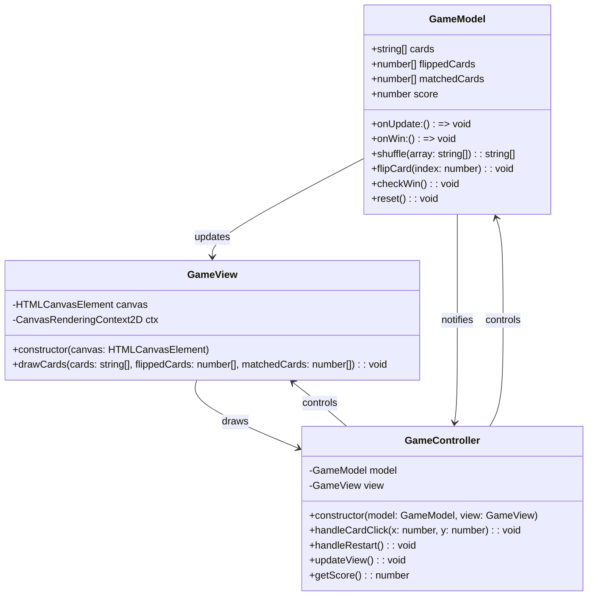

# Игровой движок <!-- omit in toc -->

- [UML диаграмма общих взаимосвязей](#uml-диаграмма-общих-взаимосвязей)
- [Базовые классы](#базовые-классы)
  - [GameModel](#gamemodel)
  - [GameView](#gameview)
  - [GameController](#gamecontroller)
- [Взаимодействие классов](#взаимодействие-классов)
  - [GameModel и GameView](#gamemodel-gameview)
  - [GameModel и GameController](#gamemodel-gamecontroller)
  - [GameView и GameController](#gameview-gamecontroller)
  - [GameController и GameModel](#gamecontroller-gamemodel)
  - [GameController и GameView:](#gamecontroller-gameview)

## UML диаграмма общих взаимосвязей

## Базовые классы

### GameModel

Класс отвечает за логику игры и хранение состояния. Этот класс включает в себя:

Свойства

|       Имя        | Описание                                  |
| :--------------: | :---------------------------------------- |
|    **cards**     | массив строк, представляющий карты в игре |
| **flippedCards** | массив индексов перевернутых карт         |
| **matchedCards** | массив индексов отгаданных карт           |
|    **score**     | текущее количество очков                  |
|   **onUpdate**   | callback для обновления состояния игры    |
|    **onWin**     | callback, вызываемая при победе           |

Методы

|                  Имя                   | Описание                                                                                    |
| :------------------------------------: | :------------------------------------------------------------------------------------------ |
| **shuffle(array: string[]): string[]** | перемешивает массив карт.                                                                   |
|   **flipCard(index: number): void**    | переворачивает карту по указанному индексу, проверяет совпадение и обновляет состояние игры |
|          **checkWin(): void**          | проверяет, отгаданы ли все карты                                                            |
|           **reset(): void**            | сбрасывает состояние игры для новой партии.                                                 |

### GameView

Класс отвечает за отрисовку игрового поля на canvas. Этот класс включает в себя:

Свойства

|    Имя     | Описание                                        |
| :--------: | :---------------------------------------------- |
| **canvas** | элемент canvas, на котором происходит отрисовка |
|  **ctx**   | контекст рисования 2D для canvas                |

Методы

|                                      Имя                                       | Описание                                                                          |
| :----------------------------------------------------------------------------: | :-------------------------------------------------------------------------------- |
|                   **constructor(canvas: HTMLCanvasElement)**                   | инициализирует canvas и его контекст                                              |
| **drawCards(cards: string[], flippedCards: number[], matchedCards: number[])** | отрисовывает все карты на игровом поле, отображая перевернутые и отгаданные карты |

### GameController

Класс за управление игрой, связывает GameModel и CanvasView. Этот класс включает в себя:

Свойства

|    Имя     | Описание                                        |
| :--------: | :---------------------------------------------- |
| **canvas** | элемент canvas, на котором происходит отрисовка |
|  **ctx**   | контекст рисования 2D для canvas                |

Методы

|                         Имя                         | Описание                                                                                               |
| :-------------------------------------------------: | :----------------------------------------------------------------------------------------------------- |
| **constructor(model: GameModel, view: CanvasView)** | инициализирует контроллер с моделью и представлением                                                   |
|   **handleCardClick(x: number, y: number): void**   | обрабатывает клики по canvas, определяет, какая карта была выбрана, и передает эту информацию в модель |
|              **handleRestart(): void**              | сбрасывает игру, вызывая метод reset модели                                                            |
|               **updateView(): void**                | обновляет представление, вызывая метод drawCards представления                                         |
|               **getScore(): number**                | возвращает текущий счет из модели                                                                      |

### Взаимодействие классов

#### GameModel и GameView:

GameModel обновляет состояние игры и вызывает onUpdate, который триггерит метод updateView у контроллера.
GameModel вызывает onWin, когда все карты отгаданы.

#### GameModel и GameController:

GameModel уведомляет контроллер об обновлениях и победе через функции обратного вызова.

#### GameView и GameController:

GameView отрисовывает текущее состояние игры по команде контроллера.
GameView использует данные из GameModel, предоставленные контроллером, для отображения карт.

#### GameController и GameModel:

GameController управляет действиями пользователя (например, клики по картам) и передает их в GameModel.
GameController инициирует перерисовку представления через метод updateView.

#### GameController и GameView:

GameController управляет отрисовкой и перерисовкой игрового поля, вызывая методы представления.
